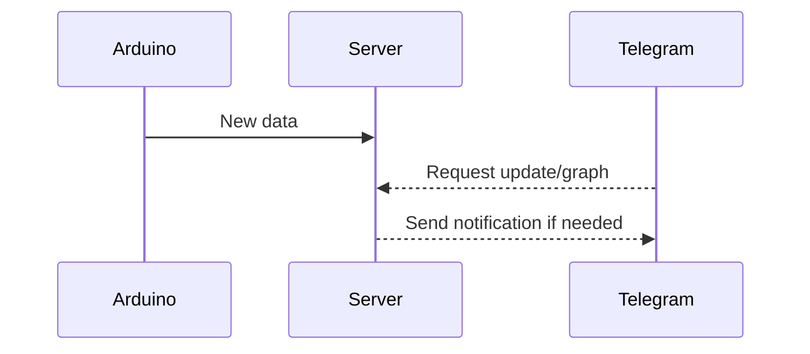

# Plantmonitor!
Software server to manage Arduino -sensor-inputs from ground sensors and Telegram notifications!
Usage:
todo

### Sequence

```mermaid
sequenceDiagram
Arduino ->> Server: New data
Telegram -->> Server: Request update/graph
Server-->> Telegram: Send notification if needed
 
``` 